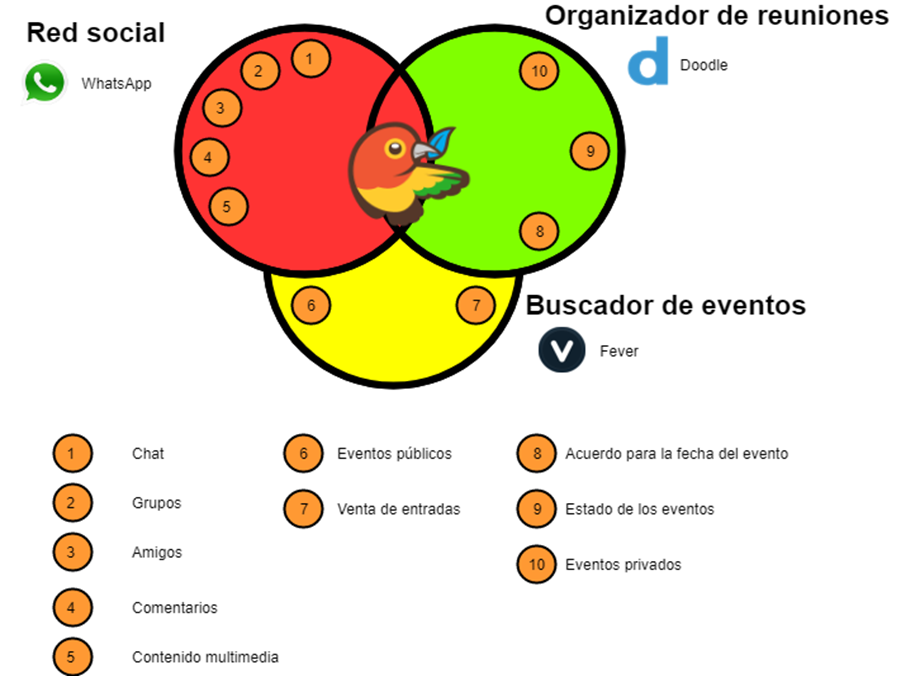

# SDM_TryToMeet
(Developed during the CS Degree) An Android application to create and organize events with your friends.

# Introduction
This is a project developed during the fourth year of the Degree in Computer Science Engineering. TryToMeet is an application for mobile devices that allows its users to organize any type of event.
The creator of the event invites users of their choice. Users will be able to vote between the dates that the creator proposes.

# Some user interfaces and videos

Video: https://youtu.be/mTGXV8k21Ak

# Comparing with other apps
TryToMeet is an application designed as a cross between a social network, a meeting application and an event application. The following image describes some features that gets from those applications:

The features implemented right now are listed here:
- Creation of events by the user
- System for choosing the date for the event
- Notifications related to an event
- Location of the event (location on the map and how to get there)
- Creation of a group of friends
- Login through other accounts
- Events with multimedia content (images, videos)
- Comments on events
- Group event invitations
- Add friends